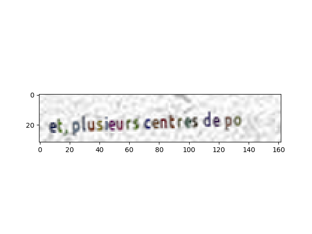
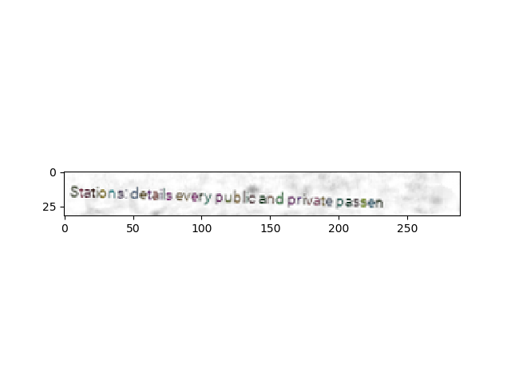
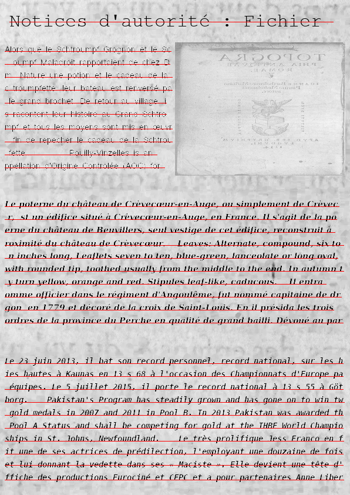

# scribbler
Automated generation of ground-truth documents

# How to use ?

```scribbler.generator``` contains two class ```DocumentGenerator``` and ```LineGeneratedSet``` which are Pytorch dataset.
You can use on any of your projet and it's fully compatible with socr.

# Resources

## Documents templates

This is an exemple of Document Template : 
```xml
<?xml version="1.0" encoding="UTF-8" ?>
<Document width="596" height="842">
    <TextLine x="16" y="16" width="564" height="48"/>
    <VerticalLayout x="0" y="64" width="596" height="778" vertical_padding="8" horizontal_padding="8">
        <HorizontalLayout>
            <Paragraph font_size="22"/>
            <Image/>
        </HorizontalLayout>
        <Paragraph font_size="22" type="handwriting"/>
        <Paragraph font_size="22"/>
    </VerticalLayout>
</Document>
```

Note that to use the ```type="handwriting"``` option, you will need to download the [IAM Handwriting Database](http://www.fki.inf.unibe.ch/databases/iam-handwriting-database), and initialize it with ```init_iam_handwriting_line_dataset``` from ```scribbler.ressources.ressources_helper```.

Each document template is an XML file which need to be placedinto the resources/structures directory.


## Resources folders

 - The backgrounds folder contains document background
 - The fonts folder contains ttf fonts
 

# Exemple 

## Exemple of generated line




## Exemple of generated document

